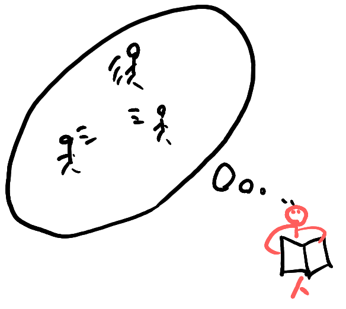
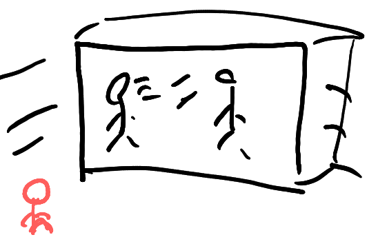
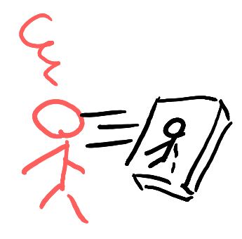
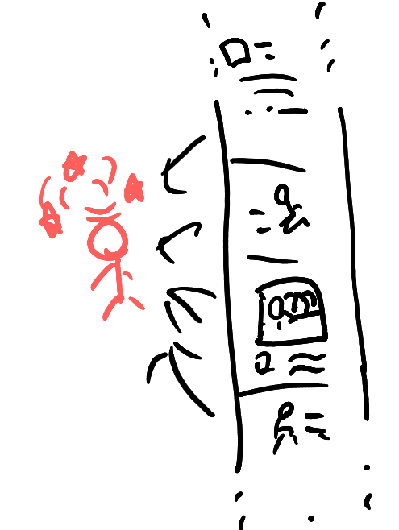

#+TITLE: 2026-02-01
#+OPTIONS: toc:nil H:1 num:nil ^:{}
#+HTML_HEAD: <link href="https://fonts.googleapis.com/css?family=Lora|Reenie+Beanie" rel="stylesheet">
#+HTML_HEAD: <link rel="stylesheet" href="./index.css">
#+HTML_HEAD: 
#+AUTHOR: kouthi

* Thoughts on the interface of information acceptance
- There are different forms of how we take in information.
- In particular, consider how we interact with others through each medium.

** books
- When we read, the author becomes a presence in our thinking.

#+caption: the interaction with others when reading
#+attr_html: :alt the interaction with others when reading :width 200

** Movies / TV Shows
- Movies and TV shows are generally packaged for display.
- We receive and consume these fixed, edited content.

#+caption: the interaction with others when watching movies and TV shows
#+attr_html: :alt the interaction with others when reading :width 200

** YouTube video
- YouTube videos are similar to movies and TV shows, but with a key difference: we often face the creator directly.
- This setup resembles a kind of confessional or intimate address.
- In that sense, the content feels more focused and directly addressed to us—both a strength and a risk.

#+caption: the interaction with others when watching YouTube contents
#+attr_html: :alt the interaction with others when reading :width 200

** short SNS contents (X/Instagram/TikTok)
- In short-form feeds, the “other” becomes diffuse; we often just reflect our own fleeting thoughts.
- The media turns into a collage of fragments, ranked by brief impressions from people in similar contexts.

#+caption: the interaction(?) with others when being mired in doom-scrolling
#+attr_html: :alt the interaction with others when reading :width 200

* What's next? Virtual Reality contents?
- VR could be a major shift from where society stands today.
- It may move us from “no tangible others” to “fully realized others.”
- I hope we avoid any scenario of societal breakdown that could spoil this hopeful expectation, given current global tensions...
